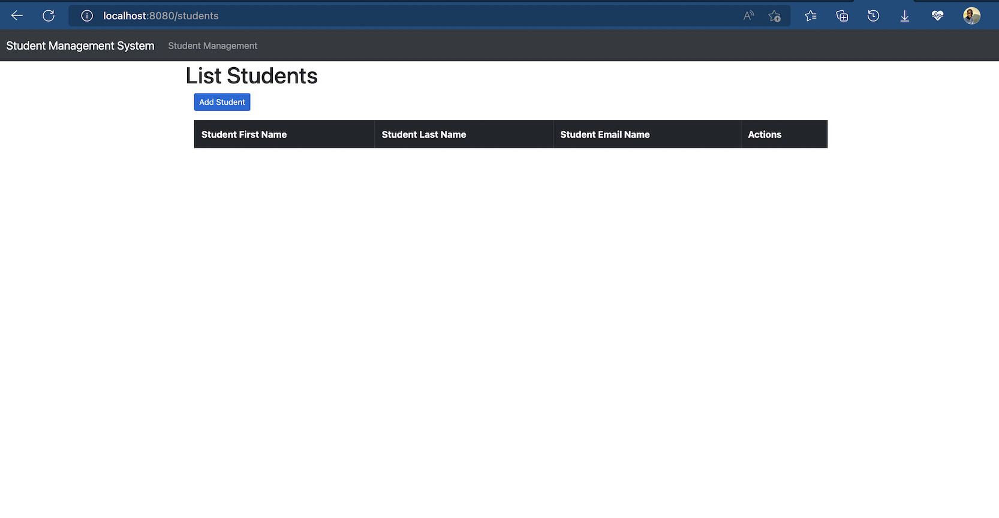
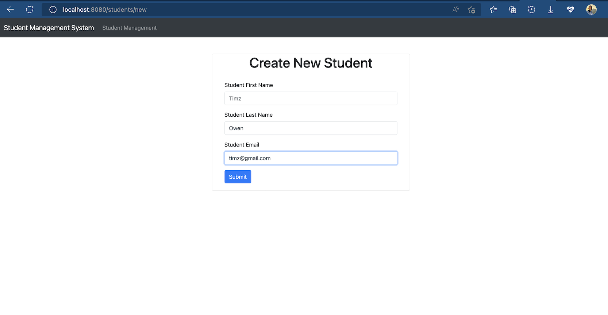
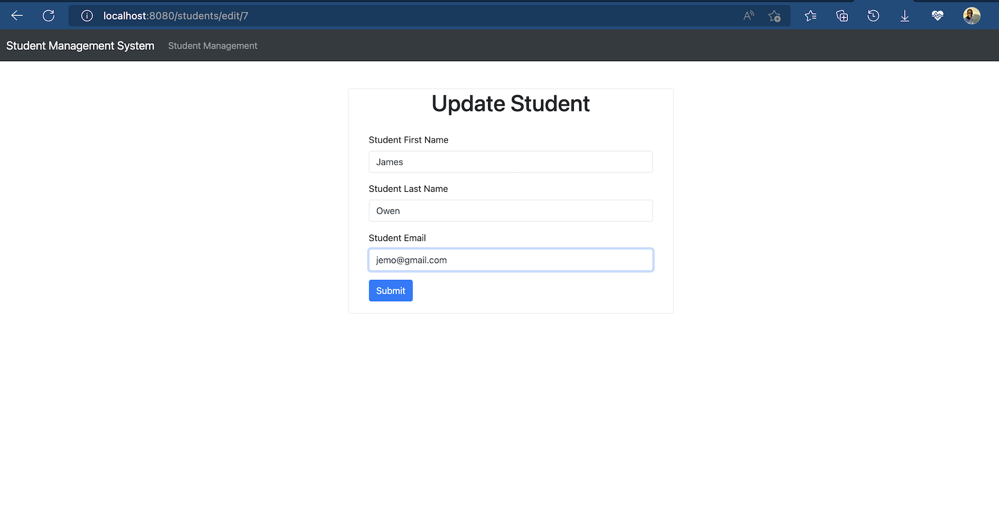
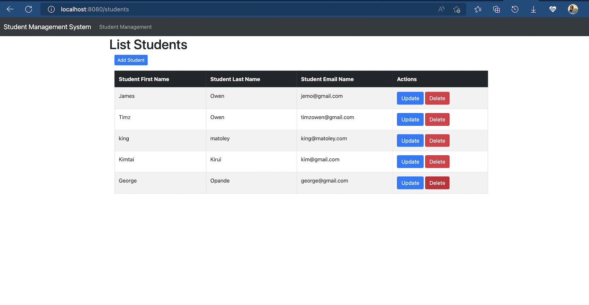

### `student-management`

springboot student management system. 

screenshot of the student management system

`Technology stack used`
1. Java 
2. Springboot
3. Thymeleaf
4. Mysql
5. Html
-------------------------

### `Packages`

#### Controller

        Implementing any Requests to be made

#### Entity:

    Contains all the details for the students

#### Repository

    Contains JPA implementation for Database Querying

#### Service 

    Contain Autowired Repository to make CRUD Operations from database

#### Templates

    Contains any front-end Html, css , Javascript & Thymeleaf pages

--------------------------
### Dependencies used

1. `Lombok` to eliminate boilerplate code (Ex. Getters and setters)
2. `MySQLDriver` for sql connection 
3. `Thymeleaf` to develop front end 
4. `springboot-stater-web` for RestFul APIs and Web capability
5. `springboot-dev-tool` to enable auto-reload without restarting server

-------------------------

Main Page

Create New Student 

Update existing student

List of updated students

